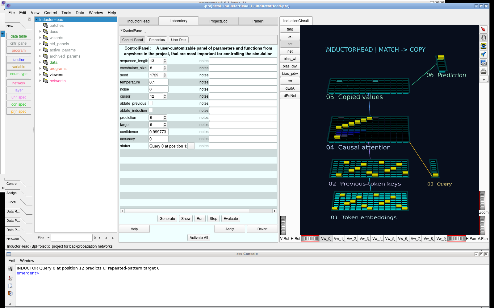

# Emergent — setup and documentation

[Back to the visual overview](../../README.md)

This fork modernizes the original C++ Emergent neural network simulator for
Clang 24 nightly, Qt 6.12 Beta 4, and C++17. It retains the CSS (C Super Script)
interpreter, reflected object system, and Coin/Quarter 3D interface.

Development is targeting **Emergent 9.0**. The [major-release gates](../docs/RELEASE_PLAN.md)
require the latest selected implementation of each model to work; the download below is an interim preview.

See [modern stack setup and verification](../tools/toolchain/README.md) for the
pinned SDK, build instructions, and test commands. C++ builds require
`-Wall -Wextra -Werror -Woverloaded-virtual`, with no warning suppression flags.

## A continuing lineage

**PDP → PDP++ → Emergent.** This C++ continuation is maintained and modernized by Brian Mingus.

The lineage reaches back to the mid-1980s PDP work of Jay McClelland, David Rumelhart and the PDP group. The original handbook records discussions about publishing the software in March 1986. PDP++ followed, with Randy O’Reilly as its principal architect and substantial contributions from McClelland and Chadley Dawson; a working version was available by 1995. The major rewrite released in late 2007 became Emergent. Brad Aisa, Brian Mingus and Randy O’Reilly authored the 2008 system paper.

Sources: [original PDP handbook introduction](https://web.stanford.edu/~jlmcc/papers/PDP/McClelland_EPDP/Intro_EPDP88.pdf), [PDP++ development history](https://sites.ucmerced.edu/files/dnoelle/files/noelle-2008.pdf), and [The Emergent Neural Modeling System](https://doi.org/10.1016/j.neunet.2008.06.016).

## Run on Linux

Download and launch the [Linux x86_64 preview](https://github.com/mingusb/emergent/releases/tag/v8.6.1-clang24-qt6.12-preview.1):

```sh
curl -fL https://github.com/mingusb/emergent/releases/download/v8.6.1-clang24-qt6.12-preview.1/emergent-linux-x86_64.tar.xz -o emergent-linux-x86_64.tar.xz
tar -xJf emergent-linux-x86_64.tar.xz
./emergent-linux-x86_64/run-inductor-head
```

This opens the interactive [Inductor Head tutorial](../demo/InductorHead/README.md), with the original native 3D viewer, controls, and CSS console. Use `./emergent-linux-x86_64/emergent` to open the general application instead. The runtime includes Qt, WebEngine, and its required libraries; no compiler or separate Qt installation is needed. It requires Ubuntu 26.04 x86_64 or a compatible newer glibc environment, with working host graphics drivers, display/audio services, fonts and a CA trust store.



On WSL with the NVIDIA/D3D12 runtime present, the launcher selects the NVIDIA GPU for the native 3D viewer and software composition for embedded web pages. It needs no Linux NVIDIA kernel driver installation. `EMERGENT_WSL_GPU=0` disables that automatic selection.

If GPU rendering is unavailable, use the software renderer:

```sh
EMERGENT_SOFTWARE_RENDERING=1 ./emergent-linux-x86_64/run-inductor-head
```

This keeps the native 3D viewer and embedded browser available using CPU rendering. The same option works with the `emergent` launcher.

For development, enter `project/` and follow the [source build instructions](../tools/toolchain/README.md). The portable runtime and source build are separate downloads.

The source branch also contains a growing [cognitive-model collection](../demo/LegacyModels/README.md),
with native tutorial tasks, offline author documentation and behavioral integration
tests. These additions follow the preview release; each model records its original
version, license and the results actually verified. The release targets the latest
author-maintained version of each distinct model, including Go-era successors;
older versions serve as references rather than separate porting targets.

The original [emer/cemer](https://github.com/emer/cemer) history, authorship,
and licenses are preserved. Its upstream team moved development to the
[Go implementation](https://github.com/emer/emergent). Historical C++
documentation is on the [upstream wiki](https://github.com/emer/cemer/wiki).

Historical releases include [8.6.1 sources](https://github.com/emer/cemer/releases/tag/v8.6.1),
[8.5.2 packages](https://github.com/emer/cemer/releases/tag/v8.5.2), and
[8.5.1 dependencies](https://github.com/emer/cemer/releases/tag/v8.5.1).

The repository root stays small; see the [project layout](../docs/REPOSITORY_LAYOUT.md) for source, models, resources and historical material.

# About

*emergent* is a comprehensive neural network simulator that enables the creation and analysis of complex, sophisticated models of the brain in the world; features:

* Full browser and 3D GUI for constructing, visualizing, & interacting.
    + Accessible to non-programmers
    + But also highly productive for experts, used daily in scientific research.
    
* Powerful C++ scripting language, `css` (not ''that'' css), GUI `Program`ming environment (IDE) -- `TypeAccess` access to C++.

* Rich, dynamic, embodied environments for training networks:
    + `DataTable` for network inputs and `DataProc`, `DataAnal`, `DataGen` (filtering, grouping, sorting, dimensionality reduction, graphing, etc).
    
    + Newtonian physics simulator for Virtual Environment, e.g., a biophysically realistic human arm, and realistic embodied, dynamic vision.
    
    + Sensory filtering for vision, audition, and vocal-tract speech.
    
* Many classic neural network algorithms and variants: Backpropagation (e.g., deep convolutional neural networks), Constraint Satisfaction, Self Organizing, and the Leabra algorithm which incorporates many of the most important features from each of these algorithms, in a biologically consistent manner.  Also, symbolic / subsymbolic ACT-R.

    + Highly optimized vector-based back-end code with thread-specific memory allocation, and GPU (CUDA); Convenient compute cluster for GUI-based job control and data management.
    
* In use for decades, for hundreds of scientific publications from a variety of different labs.  Detailed models of the hippocampus, prefrontal cortex, basal ganglia, visual cortex, cerebellum, etc.

    + Direct descendant of earlier simulators: PDP (1986) and PDP++ (1995).
